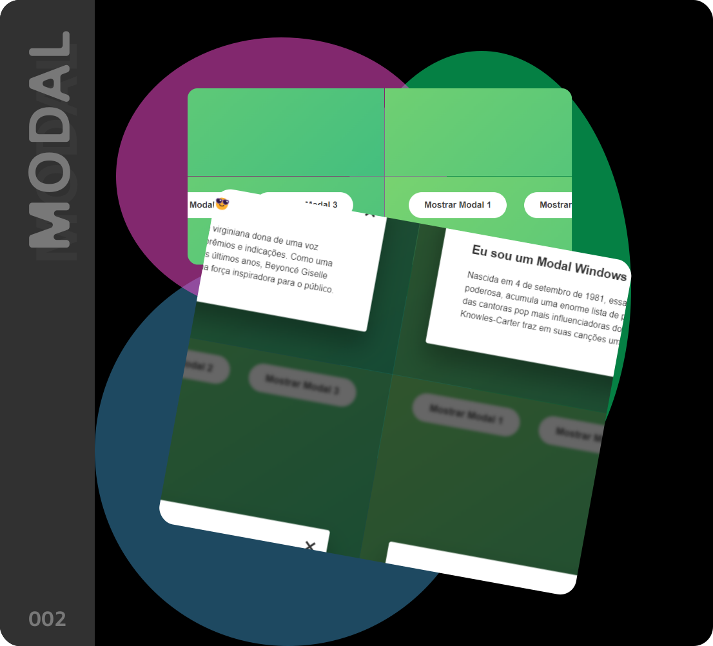

# Modal  -  for all

Este é um exemplo de como criar um modal simples usando HTML, CSS e JavaScript.

## Descrição

Este projeto consiste em um modal que pode ser acionado por botões para exibir informações adicionais na página da web. O modal é estilizado usando CSS e é controlado por JavaScript para abrir, fechar e responder a eventos do usuário.

## Pré-requisitos

Para visualizar e modificar este projeto, você precisará de um editor de código e um navegador da web.

## Instruções de Uso

1. Clone este repositório para o seu ambiente de desenvolvimento local.
2. Abra o arquivo `index.html` em um navegador da web.
3. Clique nos botões "Mostrar Modal" para exibir o modal correspondente.
4. Clique no botão de fechar (X) ou fora do modal para fechá-lo.
5. Você também pode fechar o modal pressionando a tecla Esc no teclado.

## Estrutura de Arquivos

- `index.html`: Contém a estrutura HTML do modal.
- `style.css`: Arquivo CSS para estilizar o modal e a página.
- `script.js`: Arquivo JavaScript para controlar o comportamento do modal.

## Contribuindo

Contribuições são bem-vindas! Sinta-se à vontade para enviar pull requests com melhorias, correções de bugs ou novos recursos.

## Licença

Este projeto está licenciado sob a [MIT License](LICENSE).

## Autor

[Raphael Dias](https://www.rasidia.com.br)

Dúvidas? contato@rasidia.com.br

